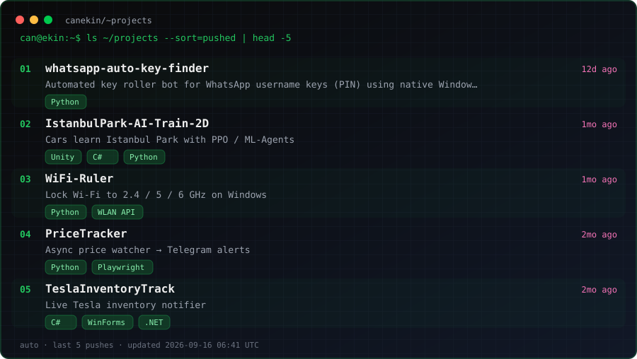
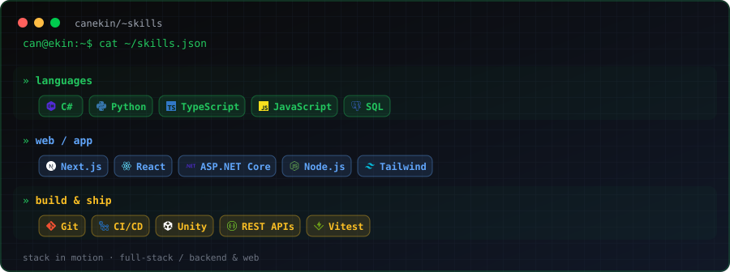
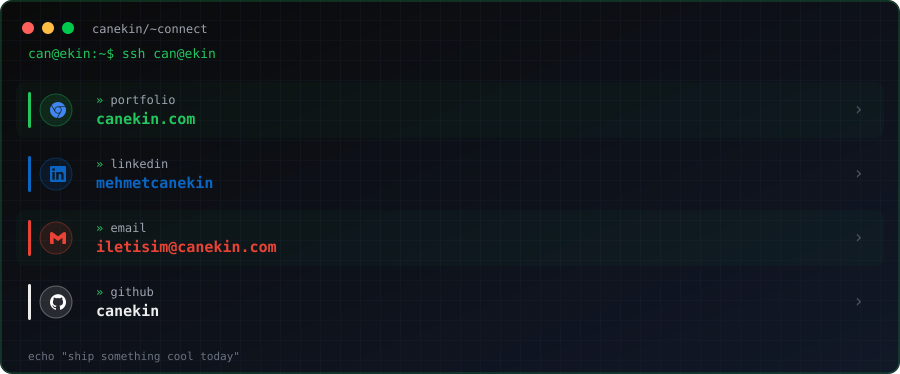

<p align="center">
  
</p>

<p align="center">
  
  &nbsp;
  <a href="https://www.canekin.com"></a>
  &nbsp;
  
</p>

<p align="center">
  <!-- START_REPO_LINE -->Welcome to my GitHub!<!-- END_REPO_LINE -->
</p>

---

### `can@ekin:~$` about

```text
Name      : Can Ekin
Role      : Software Engineering student · Full-Stack / Backend & Web
Stack     : C# · Python · Next.js · JavaScript · ASP.NET
Currently : Bahçeşehir University · building cool stuff & open for opportunities
```

---

### `./gh_stats` — live repository pulse

<p align="center">
  
  
</p>

<!-- START_REPO_STATS -->

<!-- END_REPO_STATS -->

---

### `git log --graph` — contributions

GitHub-style contribution snake.

<p align="center">
  
</p>

---

### `ls ~/projects --sort=pushed` — recently shipping

Live list of the **5 repos with the newest commits** (profile repo excluded). Refreshed by Actions.

<p align="center">
  
</p>

---

### `cat ~/skills.json`

<p align="center">
  
</p>

---

### `ssh can@ekin` — connect

<p align="center">
  
</p>

<p align="center">
  <a href="https://www.canekin.com"></a>
  <a href="https://linkedin.com/in/mehmetcanekin"></a>
  <a href="mailto:iletisim@canekin.com"></a>
  <a href="https://github.com/canekin"></a>
</p>

<p align="center">
  <sub>built with passion · visit<a href="https://www.canekin.com">canekin.com</a> </sub>
</p>
