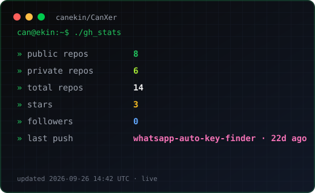
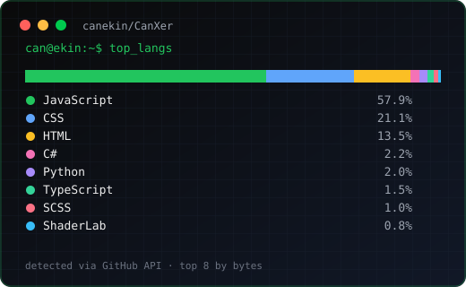
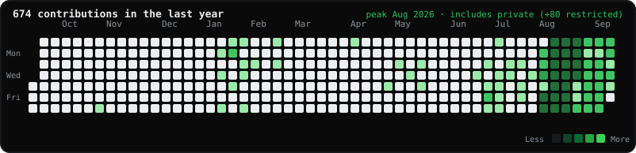

<p align="center">
  
</p>

<p align="center">
  
  &nbsp;
  <a href="https://www.canekin.com"></a>
  &nbsp;
  
</p>

<p align="center">
  <!-- START_REPO_LINE -->`7 public` · `5 private` · `12 total` · `129 contribs/yr`<!-- END_REPO_LINE -->
</p>

---

### `can@ekin:~$` about

```text
Name      : Can Ekin
Role      : Software Engineering student · Full-Stack / Backend & Web
Stack     : C# · Python · Next.js · TypeScript · ASP.NET
Currently : Bahçeşehir University · building products & bots that ship
```

---

### `./gh_stats` — live repository pulse

<p align="center">
  
  
</p>

<!-- START_REPO_STATS -->
| Metric | Count |
| :--- | ---: |
| Public repos | **7** |
| Private repos | **5** |
| Total (owned, non-fork) | **12** |
| Stars | **2** |
| Followers | **0** |
| Last push | **canekin.com · 6h ago** |

<sub>Auto-refreshed by GitHub Actions · last run: 2026-08-04 16:49 UTC</sub>
<!-- END_REPO_STATS -->

---

### `git log --graph` — contributions

GitHub-style heatmap for the last year ending today (private commits included when enabled). Peak month is called out on the card.

<p align="center">
  
</p>

<p align="center">
  
</p>

---

### `ls ~/projects` — featured work

| Repo | What it does | Stack |
| :--- | :--- | :--- |
| [IstanbulPark-AI-Train-2D](https://github.com/canekin/IstanbulPark-AI-Train-2D) | Cars learn Istanbul Park with PPO / ML-Agents | Unity · C# · Python |
| [WiFi-Ruler](https://github.com/canekin/WiFi-Ruler) | Lock Wi-Fi to 2.4 / 5 / 6 GHz on Windows | Python · WLAN API |
| [PriceTracker](https://github.com/canekin/PriceTracker) | Async price watcher → Telegram alerts | Python · Playwright |
| [TeslaInventoryTrack](https://github.com/canekin/TeslaInventoryTrack) | Live Tesla inventory notifier | C# · WinForms · .NET |
| [KararsizCarki](https://github.com/canekin/KararsizCarki) | Fun decision wheel for Android | Java · Android |
| [GrappleClimb](https://github.com/canekin/GrappleClimb) | Physics-based vertical climb arcade | Unity · C# |

Also shipping outside public GitHub: **CanXer** Discord bot (10k+ users), freelance .NET systems, and [canekin.com](https://www.canekin.com).

---

### `cat ~/skills.json`

<table>
<tr>
<td>

```bash
can@ekin:~/skills$ cat skills.json
```

</td>
</tr>
<tr>
<td>

| Layer | Tools |
| :--- | :--- |
| **Languages** | `C#` · `Python` · `TypeScript` · `JavaScript` · `SQL` |
| **Web / App** | `Next.js` · `React` · `ASP.NET Core` · `Node.js` · `Tailwind` |
| **Build & Ship** | `Git` · `CI/CD` · `Unity` · `REST APIs` · `Vitest` |

<p>
  
  
  
  
  
  
  
  
  
  
  
  
</p>

</td>
</tr>
</table>

---

### `ssh can@ekin` — connect

<table>
<tr>
<td>

```bash
can@ekin:~$ ssh can@ekin
# authorized keys
```

</td>
</tr>
<tr>
<td>

| Channel | Handle |
| :--- | :--- |
| 🌐 Portfolio | [canekin.com](https://www.canekin.com) |
| 💼 LinkedIn | [mehmetcanekin](https://linkedin.com/in/mehmetcanekin) |
| ✉️ Email | [iletisim@canekin.com](mailto:iletisim@canekin.com) |
| ⌨ GitHub | [canekin](https://github.com/canekin) |

<p>
  <a href="https://www.canekin.com"></a>
  <a href="https://linkedin.com/in/mehmetcanekin"></a>
  <a href="mailto:iletisim@canekin.com"></a>
  <a href="https://github.com/canekin"></a>
</p>

```bash
echo "ship something cool today"
```

</td>
</tr>
</table>

<p align="center">
  <sub>built to match <a href="https://www.canekin.com">canekin.com</a> · refreshed without me touching it</sub>
</p>
